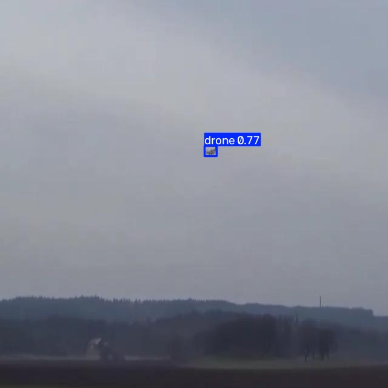

# Drone Detection System

Real-time drone detection with a confirmation timer to reduce false positives from birds, built with a custom-trained YOLO11 model, ByteTrack, and SQLite logging.



## Overview

The system watches a live feed and tracks detected objects with ByteTrack. Rather than alerting on a single detected frame, it waits for 3 continuous seconds of detection before treating an object as a confirmed drone — a deliberate tradeoff to cut down on birds being misidentified as drones. Every confirmed detection is logged to SQLite with a screenshot.

| Class | Label |
|-------|-------|
| 0     | Drone |

## Features

- Custom-trained YOLO11 model for drone detection
- ByteTrack object tracking, so each tracked object keeps a consistent ID across frames
- 3-second confirmation timer to reduce false positives from birds
- Confidence threshold of 0.65, tuned specifically to reduce bird misdetections
- Two screenshots saved per confirmed detection — a cropped region and the full frame
- SQLite event logging — drone status, confidence, screenshot status, and timestamp
- Per-track state resets automatically once a track is no longer detected as a drone

## Model Evaluation

Evaluated on a held-out validation set of 38 images (49 instances).

| Metric | Value |
|--------|-------|
| Precision | 0.939 |
| Recall | 0.934 |
| mAP50 | 0.984 |
| mAP50-95 | 0.761 |

Model: YOLO11n (fused) — 101 layers, 2,582,347 parameters, 6.3 GFLOPs.

mAP50 of 0.984 reflects strong detection reliability at a standard IoU threshold, with precision and recall both above 0.93 on a small but clean validation set.

## Design Decisions

**3-Second Confirmation Delay**
A 3-second delay was added to reduce the problem of the model mistakenly detecting birds as drones. This doesn't completely eliminate false detections, but it significantly reduces them.

Ideally, the system would capture and report a detected drone immediately, without any delay — a real drone can be a potential security threat and should be reported as soon as possible. The 3-second confirmation period is a temporary tradeoff to reduce bird-related false positives while that detection problem is addressed at the model level.

**Confidence Threshold (0.65)**
A threshold of 0.65 was set to further reduce false detections caused by birds, on top of the confirmation delay.

## Getting Started

### Install

```bash
git clone https://github.com/i0nlyaziz/Drone-Detection-System.git
cd Drone-Detection-System
pip install -r requirements.txt
```

### Run

```bash
python main.py
```

This opens your webcam (index 0) and shows the annotated feed in a window. Press `q` to quit.

The model path and camera index are set directly in `main.py` rather than passed as arguments — open the file and edit those values if you need a different weights file or camera source.

## Project Structure

```
Drone-Detection-System/
├── README.md
├── LICENSE
├── requirements.txt
├── .gitignore
├── main.py                 # detection, tracking, confirmation timer, and database logging
├── weights/
│   ├── best.pt               # trained weights (portable — see below)
│   └── README.md
└── results/
    └── demo.jpg               # sample detection output
```

## How It Works

1. Loads the trained model (`best.pt`) and runs `model.track()` with ByteTrack on every frame.
2. For each tracked box above 0.65 confidence, checks the class:
   - **Class 0 (Drone)** — draws a red box, starts (or continues) a 3-second timer for that track.
   - Anything else clears the track's timer and resets its state.
3. Once a track has been flagged as a drone for 3 continuous seconds, both a cropped and full-frame screenshot are saved and the event is logged.
4. Confirmed detections are written to `DataBase.db` — drone status, confidence, screenshot status, and timestamp.

## Database

`DataBase.db`, table `info`:

| Column | Type | Description |
|--------|------|-------------|
| Id | INTEGER PRIMARY KEY | Event ID |
| Drone | TEXT | "Yes" or "No" |
| Confidence | REAL | Detection confidence |
| Screenshot | TEXT | Whether a screenshot was saved |
| Date | TEXT | Timestamp the track was first seen |

## Tech Stack

YOLO11, Ultralytics, ByteTrack, OpenCV, SQLite

## Limitations

- The system requires a high-resolution camera to make drone detection faster and easier, especially when the drone is far away or appears small in the image
- The 3-second confirmation delay trades off some response time to reduce bird-related false positives — a real threat is only reported after this delay, not instantly
- The 3-second timer assumes continuous tracking; if tracking briefly drops the object, the timer resets
- Camera index and file paths are hardcoded in `main.py`
- Screenshots and `DataBase.db` are generated at runtime and aren't part of the repo

## License

MIT — see [LICENSE](LICENSE) for details.